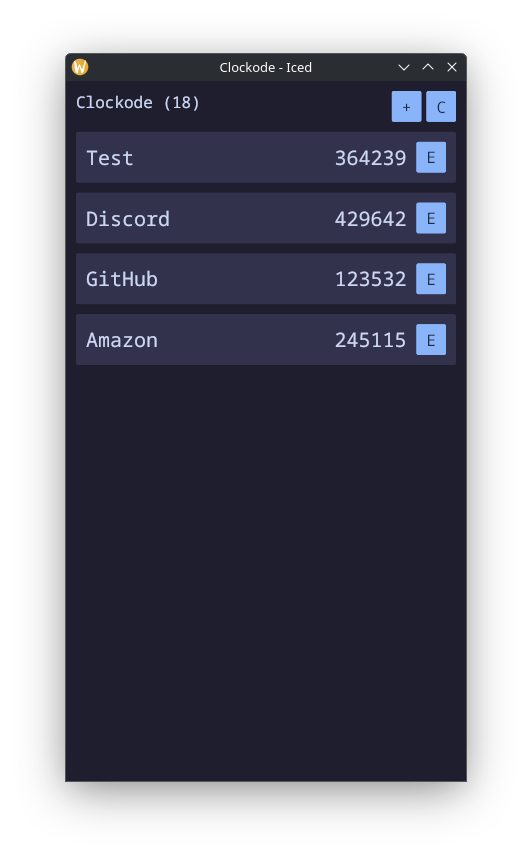

   
  
  <h1>Clockode</h1>

  
  

  <h3>Minimal TOTP client made with Iced</h3>

  

## Notes

> [!WARNING]
> The app works right now; however, there are a few things that I want to address before release, such as improving the code regarding vault/vault data handling or creating a custom theme for the app.

 

*Icon from [SVGRepo](https://www.svgrepo.com/svg/408420/lock-security-open) made by [Tolu Arowoselu](https://www.svgrepo.com/author/Tolu%20Arowoselu/) (colors modified by myself).

## About me

Check out my [other projects](https://github.com/mariinkys) 

You can also help do this and more projects, [Buy me a coffee](https://www.buymeacoffee.com/mariinkys)