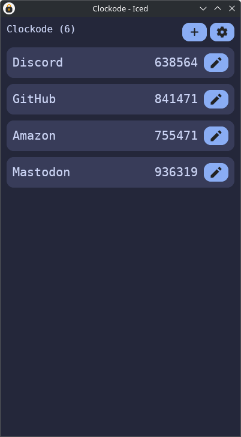

<div align="center">
  <br>
  
  <h1>Clockode</h1>

  
  
  


  <h3>TOTP client made with Iced</h3>

  
  

  <br><br>

  <a href="https://flathub.org/apps/dev.mariinkys.Clockode">
    
  </a>
</div>

## Notes

Key features are:

- Storage for all your 2FA and OTP tokens
- Automatic TOTP code generation
- Data is encrypted on your device using battle-tested software (libraries)
- Backup and import functionality (standard format)

If you want to sync your vault you will have to do it yourself using tools like Syncthing...

> [!WARNING]
> As with any app that manages important data, please ensure you back up your data offsite regularly.

## Installation
### Linux
You can [download the Flatpak on Flathub](https://flathub.org/apps/dev.mariinkys.Clockode).

Or you can use [just](https://github.com/casey/just) to install the package:
```
git clone https://github.com/mariinkys/clockode.git
cd clockode
cargo build --release
sudo just install
```

## Attributions

<a href="https://github.com/iced-rs/iced">
  
</a>

<p></p>

> "[Pop Icons](http://github.com/pop-os/icon-theme)" by [System76](http://system76.com/) is licensed under [CC-SA-4.0](http://creativecommons.org/licenses/by-sa/4.0/)

> Application Icon from [SVGRepo](https://www.svgrepo.com/svg/408420/lock-security-open) made by [Tolu Arowoselu](https://www.svgrepo.com/author/Tolu%20Arowoselu/) (colors modified by myself).

## Development Notes
In order to build the Flatpak, first you need to create the 'cargo-sources.json' file, for that we'll use [this python script, from flatpak-builder-tools](https://github.com/flatpak/flatpak-builder-tools/tree/master/cargo), remember that the 'tomlkit' and 'aiohttp' python modules are needed (they can be installed with pip).

Once you have that, with the python script in the root of the project, you can start with:
```
python3 flatpak-cargo-generator.py Cargo.lock -o cargo-sources.json
```
This will create the needed 'cargo-sources.json' file. 
Then you already can build and install the Flatpak with:
```
flatpak-builder --user --install --force-clean build-dir dev.mariinkys.Clockode.json
```
You can also build the Flatpak and not install it with:
```
flatpak-builder --force-clean build-dir dev.mariinkys.Clockode.json
```
Useful resources include:
[Flatpak Docs](https://docs.flatpak.org/en/latest/first-build.html). Remember that whenever the dependencies change/are updated the 'cargo-sources.json' file needs to be rebuilt.

## About me

Check out my [other projects](https://github.com/mariinkys) 

You can also help do this and more projects, [Buy me a coffee](https://www.buymeacoffee.com/mariinkys)

# Copyright and Licensing

Copyright 2025 © Alex Marín

Released under the terms of the [GPL-3.0](./LICENSE)
